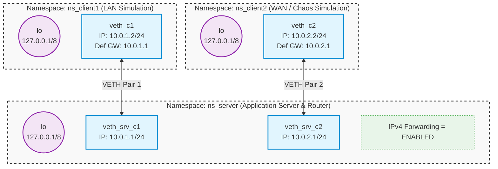

[View on GitHub]()

## Address conversions

See how to convert textual and binary IPv4 addresses back and forth:

```shell
make -B addrconv
```
[addrconv.c]()

```shell
./addrconv 192.168.1.100
./addrconv 127.0.0.1
./addrconv 256.0.0.1
./addrconv abrakadabra
```

## Binding addresses

```shell
make -B addrbind
```
[addrbind.c]()

Bind localhost address:

```shell
./addrbind 127.0.0.1 8080
```

Bind `INADDR_ANY`:

```shell
./addrbind 0.0.0.0 8080
```

Explicitly bind ephemeral port:

```shell
./addrbind 127.0.0.1 0
```

## Network setup

Set up server independently connected with two clients over two distinct networks:

```shell
sudo ./two_clients.sh up
```
[two_clients.sh]()



Namespace `ns_server` will act here both, as a routing device between networks `10.0.1.0/24` and`10.0.2.    0/24`
and as a node running the server application and receiving traffic.

Note clients have a default gateway configured to `10.0.1.1` and `10.0.2.1` respectively.

Verify connectivity:

```shell
sudo ip netns exec ns_client1 ping -c 2 10.0.1.1 # Client 1 <-> Server
```
```shell
sudo ip netns exec ns_client2 ping -c 2 10.0.2.1 # Client 2 <-> Server
```
```shell
sudo ip netns exec ns_client1 ping -c 2 10.0.2.2 # Client 1 <-> Client 2
```
```shell
sudo ip netns exec ns_client2 ping -c 2 10.0.1.2 # Client 2 <-> Client 1
```

---

## User Datagram Protocol

### Basic Usage

```shell
make time_server time_client
```
[time_protocol.h]()
[time_server.c]()
[time_client.c]()

Run server bound on `INADDR_ANY:8080`:

```shell
sudo ip netns exec ns_server ./time_server 0.0.0.0 8080
```

And try to have it serve some requests:

```shell
sudo ip netns exec ns_client1 ./time_client 10.0.1.1 8080
```

```shell
sudo ip netns exec ns_client2 ./time_client 10.0.2.1 8080
```

Capture an incoming packet and inspect them:

```shell
sudo ip netns exec ns_server tcpdump -i veth_srv_c1 -n -c 1 -v -XX -w udp.pcap --print udp port 8080
```

```shell
tshark -r udp.pcap -V -x
```

### Binding specific interface

```shell
sudo ip netns exec ns_server ./time_server 10.0.1.1 8080
```

Observe that client 1 is handled as previously, client 2 requests are not processed.

Note packets from client 2 are reaching the server. The OS net stack drops them and generates back ICMP response:

```shell
sudo ip netns exec ns_server tcpdump -i veth_srv_c2 -n
```

Experiment with binding non-local adresses:

```shell
sudo ip netns exec ns_server ./time_server 10.0.3.1 8080
```

### Localhost communication

Try binding `lo` address:

```shell
sudo ip netns exec ns_server ./time_server 127.0.0.1 8080
```

```shell
sudo ip netns exec ns_server ./time_client 127.0.0.1 8080
```

Note `ns_server` used in **client** invocation. External communication won't in such a setup.

### Port choice

Try to run multiple servers in parallel and note `Address already in use` error:

```shell
sudo ip netns exec ns_server ./time_server 0.0.0.0 8080
```

You can easily check with `ss` (_socket statistics_) tool system-wide port usage:

```shell
sudo ip netns exec ns_server ss -aun
```

Try running server bound on 10.0.1.1 and 10.0.2.1 in parallel.

Note that in the host namespace, typically binding low ports (< 1024) is not allowed.

```shell
./time_server 127.0.0.1 999
```

In explicitly created namespaces there are no such restrictions.

### Packet loss

Inject random packet drops between server and client 2 simulating weak connection:

```shell
sudo ip netns exec ns_client2 tc qdisc add dev veth_c2 root netem loss 40%
```

Run the server as normal:

```shell
sudo ip netns exec ns_server ./time_server 0.0.0.0 8080
```

Observe client 1 running normally:

```shell
sudo ip netns exec ns_client1 ./time_client 10.0.1.1 8080
```

Check how client 1 behaves:

```shell
sudo ip netns exec ns_client2 ./time_client 10.0.2.1 8080
```

Never assume any single UDP packet gets delivered. **Always expect it to be lost!**

Rollback to the normal state:

```shell
sudo ip netns exec ns_client2 tc qdisc del dev veth_c2 root
```

### Reorderings

Build and try out the client sending a burst of requests:

```shell
make time_burst_client
```

```shell
sudo ip netns exec ns_client2 ./time_burst_client 10.0.2.1 8080
```

Now let's simulate another possible network behavior - packet reordering:

```shell
sudo ip netns exec ns_client2 tc qdisc add dev veth_c2 root netem delay 500ms 400ms distribution normal reorder 50%
```

Try running client 2 now and observe server and client logs.

**Never assume UDP datagram delivery order!**

Rollback to the normal state:

```shell
sudo ip netns exec ns_client2 tc qdisc del dev veth_c2 root
```

### Datagram truncation

Run UDP echo server:

```shell
make -B echo_server
```
[echo_server.c]()

```shell
sudo ip netns exec ns_server ./echo_server
```

Utilize `nc` as a client which sends a datagram line by line:

```shell
sudo ip netns exec ns_client1 nc -u 10.0.1.1 5678
```

Observe that messages longer than the server's read buffer size get truncated.

---

## Transmission Control Protocol

### TCP Sink Server

```shell
make byte_sink
```
[byte_sink.c]()

Setup `ss` watch before running the server:
```shell
sudo ip netns exec ns_server watch -n0.1 ss -tan
```

Setup `tcpdump` too:
```shell
sudo ip netns exec ns_server tcpdump -i veth_srv_c1 -n tcp port 8080
```

```shell
sudo ip netns exec ns_server ./byte_sink
```

Try connecting to the server before `listen()` and observe packet dump:
```shell
sudo ip netns exec ns_client1 nc -nv 10.0.1.1 8080
```

Note the remote server responds with `RST` segment refusing the connection.

Now let the server call `listen()`. Check `ss` output. Re-try to connect:
```shell
sudo ip netns exec ns_client1 nc -nv 10.0.1.1 8080
```

Note:
* client socket emerged in `ss` in `ESTABLISHED` state, it has a peer address set.
* the whole handshake is completed without any server process intervention.
* client may even send some data and get it acknowledged

Now, let the server call `accept()`. Observe nothing changes in `ss` or `tcpdump`.

Receive bytes, observe decreasing Rx buffer length in `ss`.

Close the connection by terminating `nc` and observe server reading EOF.

Follow-ups:
* Send some data before server calls `accept()`
* Close the connection before server calls `accept()`
* Try to connect more clients, while the first one is still connected.

### Client application

Now build and use small client application which reads from `stdin` and writes everything to an established TCP conneciton.

```shell
make simple_nc
```
[simple_nc.c]()

```shell
sudo ip netns exec ns_client1 ./simple_nc 10.0.1.1 8080
```

Experiment as previously.

Try to populate server Rx buffer and `C-d` to send `FIN` fin. Observe server reading EOF.

Follow-ups:
* Kill the server when it's Rx buffer is empty. Close the client without sending anything more!
  * Observe server socket going into `TIME_WAIT` state.
  * Try re-running the server immediately after.
* Kill the server when it's Rx buffer is empty, then close the client!
  * Observe that the client cannot distinguish between half-closed and fully-closed stream just by writing.
  * Note the first attempt to send works and the next one kills the client application!
* Kill the server when it's Rx buffer is **not** empty
  * Again see client gets killed with signal on second write attempt.

### KV Store

Now let's build a simple key-value store server which interatively serves many clients, processing their requests and sending reponses.

```shell
make kv_store kv_client
```
[kv_protocol.h]()
[kv_store.c]()
[kv_client.c]()

Sniff traffic on port 8085:
```shell
sudo ip netns exec ns_server tcpdump -i veth_srv_c1 -n tcp port 8085
```

```shell
sudo ip netns exec ns_server ./kv_store
```

Run the first client and play with the commands:
```shell
sudo ip netns exec ns_client1 ./kv_client 10.0.1.1 8085
```

Without closing the first client run the second one and attempt to do something:
```shell
sudo ip netns exec ns_client2 ./kv_client 10.0.2.1 8085
```

Observe requests are served only after the first client disconnects.

Follow-ups:
* Try to execute special `fire` command
  * Observe server gets killed with `SIGPIPE`.

### Network breaks

Let's now run applications communicating through the router `ns_server` node:

```shell
sudo ip netns exec ns_client2 ./kv_store
```

```shell
sudo ip netns exec ns_client1 ./kv_client 10.0.2.2 8085
```

Use TCP dump to observe incoming packets:
```shell
sudo ip netns exec ns_server tcpdump -i veth_srv_c1 -n tcp port 8085
```

Now, let the excavator step in and break the optical link somewhere between:
```shell
sudo ip netns exec ns_server sysctl -w net.ipv4.ip_forward=0
```

Try to send another command from the client and observe that:
* The `send()` syscall in the client succeeds immediately without errors!
* In tcpdump, the router actively drops the `PSH` packet
* Retries happen with decreasing frequency (Exponential Backoff)
* Client application remains blocked on `recv()`. It should eventually fail after ~15 minutes when the TCP maximum retry limit is reached (`ETIMEDOUT`).
* The server, blocked on its own `recv()`, has absolutely no idea the network is down. It cannot distinguish between a broken link and an idle client!
  * This is why application-level Keep-Alives exist

To restore back to a normal state:
```shell
sudo ip netns exec ns_server sysctl -w net.ipv4.ip_forward=1
```

### Flow Control

Let's run application which serves `/dev/urandom` bytes in chunks of 1KiB.

```shell
make random_server random_client
```
[random_server.c]()

Run `tcpdump` on port 8089:

```shell
sudo ip netns exec ns_server tcpdump -i veth_srv_c1 -n tcp port 8089
```

Observe also `ss` queue lengths on the **client side**:

```shell
watch -n0.1 sudo ip netns exec ns_client1 ss -tn
```

Start the server:

```shell
sudo ip netns exec ns_server ./random_server
```

Request 100 random bytes to confirm:

```shell
sudo ip netns exec ns_client1 ./random_client 10.0.1.1 100
```

Now simulate a really slow client:

```shell
sudo ip netns exec ns_client1 ./random_client 10.0.1.1 10000000 | pv -q  -L 4k > /dev/null
```

`pv` here acts as a bandwidth limiter. `random_client` shall output those 10MB of data in 4kB chunks to it's stdout. 
`pv` will limit the speed of the output to 4kB/s.

Note the cascade of events:
* `random_client` blocks on write to `stdout`
* client side Rx buffer becomes full
* client sends **zero window** segments letting know the server to stop transmitting
* server side Tx buffer becomes full
* server blocks on `send()` syscall!

### Close handling

Now let's run the clinent requesting large amount of data and let's interrupt it via C-c:

```shell
sudo ip netns exec ns_client1 timeout 1s ./random_client 10.0.1.1 10000000000 > /dev/null
```

Note server receives `RST` segment. In response `send()` fails with `ECONNRESET`.

Do the same, but this time, request server side sleeps between sending chunks:

```shell
sudo ip netns exec ns_client1 timeout 1s ./random_client 10.0.1.1 10000000000 100 > /dev/null
```

Note that server got killed with `SIGPIPE` signal.

This is because it attempted to write to a closed socket (one which already received `RST` segment).

Previously this was not the case as RST came **while** the server thread was within the `send()` syscall.

In general, TCP writers should always be prepared for `EPIPE`/`SIGPIPE` errors.

