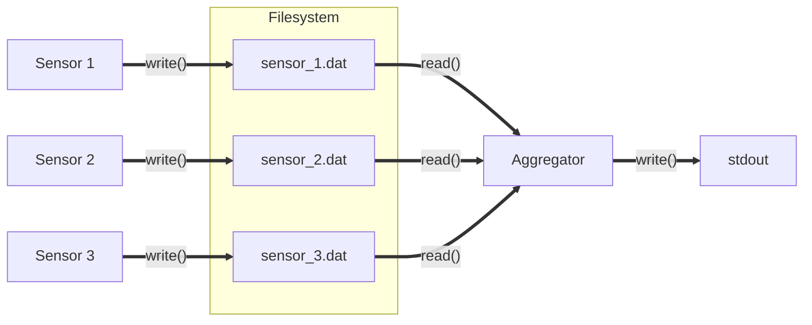

[View on GitHub]()

### Semaphores in SHM

```shell
make sem_shm
./sem_shm
```
Source: [sem_shm.c]()

### Named semaphores

Example presents parallel data producers: `sensor` processes which periodically generate files
picked up by a single `aggregator` process.



```shell
make sensor aggregator
./aggregator 3
```
Source: [sensor.c]() [aggregator.c]()

```shell
./sensor 0 &
./sensor 1 &
./sensor 2 &
wait
```


See into the Linux debug fs:

```shell
ls -l /dev/shm/sem.can_overwrite /dev/shm/sem.data_ready
```

```shell
xxd /dev/shm/sem.can_overwrite
```

### Bounded Buffer Problem

```shell
make bounded_buffer_sem
./bounded_buffer_sem
```
Source: [bounded_buffer_sem.c]()

### Shared mutexes

```shell
make record_db_setup
./record_db_setup
```

```shell
make record_db_worker
./record_db_worker 0 10000
```

Simulate load:

```shell
time {
for i in {1..1000}
do ./record_db_worker $((i % 5)) 10000 & 
done
wait
}
```

Compare timing with global locking strategy:

```shell
make record_db_setup_global
./record_db_setup_global
```

```shell
make record_db_worker_global
time {
for i in {1..1000}
do ./record_db_worker_global $((i % 5)) 10000 & 
done
wait
}
```

### Mutex attributes

```shell
make mtx_attributes
./mtx_attributes
```

Try changing mutex type to `PTHREAD_MUTEX_ERRORCHECK` and then `PTHREAD_MUTEX_RECURSIVE`.


### Robust mutexes

Note that too many `steps` in the record worker cause stack overflow:

```shell
make record_db_setup record_db_worker
./record_db_setup
./record_db_worker 0 100000
```

This leaves the shared memory block corrupted:

```shell
./record_db_worker 0 1000
```

Other records are ok (at least for now):

```shell
./record_db_worker 1 10000
```

Use robust mutexes to detect owner dead condition:

```shell
make record_db_setup_robust record_db_worker_robust
./record_db_setup_robust
./record_db_worker_robust 0 100000
./record_db_worker_robust 0 1000
```

Proceed with the real test (chaos engineering!):

```shell
for i in {1..1000}
do ./record_db_worker_robust $((i % 5)) $(( RANDOM % 10 == 0 ? 100000 : 10000 )) 
done
wait
```

### Conditional Variables

```shell
make bounded_buffer_cv
./bounded_buffer_cv
```

```shell
make readers_writers_cv
./readers_writers_cv
```
